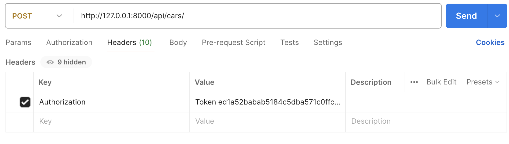

# 🛑 Car Tablosuna Yazmayı Engelle

Kullanıcılar <mark style="background-color:red;">Car</mark> tablosunu okuyabilirler ama yazamazlar. Bunu sağlamak için bir permission class yazmalıyız

## Start Project

`git clone git@github.com:msdsn/Rent-A-Car-App.git`

`git checkout ded6197d6e3dd5a29fce607619ef62ab282e5f25`

[Kurulumu Tamamla](projeye-istedigin-yerden-basla.md)

***

## Adım adım

<mark style="background-color:purple;">permissions.py</mark> isminde bir dosya olusturalim


```python
from rest_framework import permissions

class IsAdminOrReadOnly(permissions.BasePermission):
    def has_permission(self, request, view):
        if request.method in permissions.SAFE_METHODS:
            return True
        return request.user and request.user.is_staff
```


Herkes okuyabilir ama sadece adminler Create Update Delete işlemlerini yapabilir.

```python
# ... [Öceki importlar]
from .permissions import IsAdminOrReadOnly
class CarViewSet(ModelViewSet):
    # ...
    permission_classes = (IsAdminOrReadOnly,)
```

#### Deneme yapalım

1. Super user oluşturalım `python manage.py createsuperuser`
2. Admin panelden token alalım
3.  Admin token ile post deneme

    <figure><figcaption></figcaption></figure>
4.  Body -> Row

    ```postman_json
    {
        "plate_number": "XXX 001 G",
        "brand": "Future",
        "model": "T1",
        "year": 2090,
        "gear": "A",
        "rent_per_day": 750,
        "availability": true
    }
    ```
5. Normal bir kullanıcı oluşturalım: `http://127.0.0.1:8000/users/register/`
6. Onun token değeri ile deneyelim
